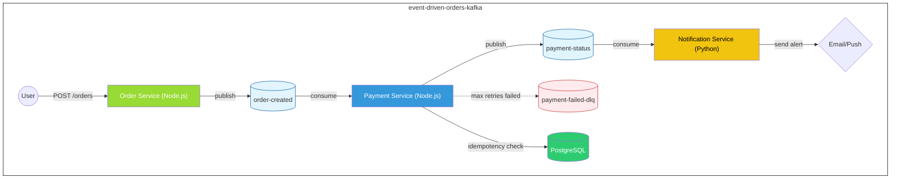

# Event-Driven Orders Kafka

Event-driven order processing system powered by Apache Kafka.

## Project Architecture

The project follows an Event-Driven Architecture (EDA) to ensure decoupling and horizontal scalability between services.

### Architecture Diagram



### Communication Flow

The system's core flow operates asynchronously as follows:

1. **Order Service:** The user makes a request (`POST /orders`). The service receives it, registers the order intent, and publishes an event to the `order-created` topic.
2. **Kafka:** Acts as the central nervous system (message broker), storing and distributing events among interested microservices, enabling highly available delivery.
3. **Payment Service:** Consumes messages from the `order-created` topic, ensures idempotency (so payments aren't processed twice by querying `PostgreSQL`), processes the payment, and publishes a success or failure response to the `payment-status` topic. If retries (e.g., reaching out to a financial API) are exhausted, the message is routed to the `payment-failed-dlq` (Dead Letter Queue).
4. **Notification Service:** Listens to the `payment-status` topic. Based on whether the payment was approved or declined, this service dispatches the appropriate alerts (`Email`/`Push Notification`) to notify the user.


### Folder Structure

```text
/event-driven-orders-kafka
  ├── /order-service         # Service responsible for creating and managing orders (Node.js)
  ├── /payment-service       # Service responsible for processing payments (Node.js)
  ├── /notification-service  # Service responsible for sending notifications (Python)
  ├── /infra                 # Database scripts, migrations, and shared configurations
  ├── docker-compose.yml     # Kafka environment orchestration (Zookeeper, Broker, Control Center)
  └── README.md              # Main documentation
```

## Technologies

- **Messaging:** Apache Kafka (Confluent Platform 7.8.7)
- **Services:**
  - Order Service: Node.js
  - Payment Service: Node.js
  - Notification Service: Python
- **Infrastructure:** Docker & Docker Compose

## Getting Started

### Prerequisites
- Docker & Docker Compose installed.

### Spinning up the Kafka Environment
```bash
docker compose up -d
```
The Control Center UI will be available at `http://localhost:9021`.
